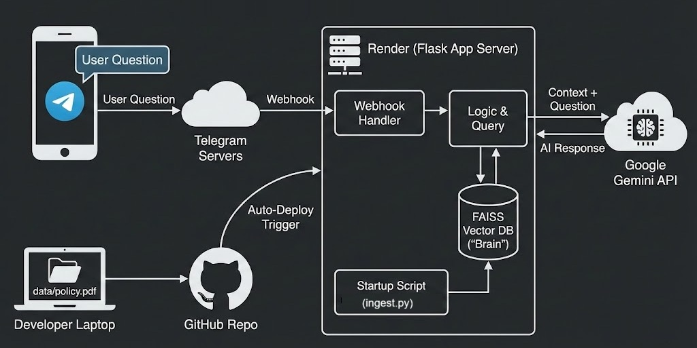

# AI Knowledge Assistant (Telegram Bot)

A smart, cloud-hosted Telegram bot that answers questions based on your custom internal documents. It uses **Google Gemini AI** for reasoning and **FAISS** for vector memory, allowing users to "chat" with static PDF files.

---

## Try It Out

You can interact with the live bot on Telegram! Scan the QR code below or search for **`@test_rag_mainak_bot`**.

---

## About the Knowledge Base (The PDF)

This bot is currently trained on **Company Policy Documents** & **agent_architecture**(e.g., `policy.pdf`).

It allows users to ask natural language questions instead of searching through pages of text. The bot currently handles topics such as:

* **Leave Policies:** Sick leave, casual leave, and holiday calendars.
* **Workflows:** Standard operating procedures and compliance guidelines.
* **General HR Queries:** Benefits, office timings, and code of conduct.

* **M365 Agentic API:** M365 Agentic API Developer Guide, Architecture, Workflow etc.

*(Note: To change this knowledge base, simply replace the PDF in the `data/` folder and push the code to GitHub. The bot learns the new content automatically.)*

---

## Key Features

* **Cloud-Native Brain:** The bot builds its knowledge base ("Brain") automatically on the Render server every time it restarts.
* **Zero-Maintenance Updates:** Just push a new PDF to GitHub, and the bot updates itself.
* **Advanced AI:** Powered by Google's `gemma-3-27b-it` model for human-like understanding.
* **Source Citation:** (Optional) Can be configured to cite which page the answer came from.

---

## Tech Stack

* **Language:** Python 3.11
* **AI Engine:** Google Gemini (`gemma-3-27b-it`)
* **Framework:** Flask (Web Server)
* **Orchestration:** LangChain (Stable v0.1)
* **Vector Database:** FAISS (Facebook AI Similarity Search)
* **Hosting:** Render Web Service

## How to Update the Knowledge

To teach the bot something new (e.g., upload a new 2026 Policy):

Delete the old file in the `data/` folder and paste your new PDF.
